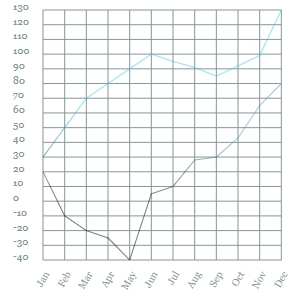

# hichart

    

在使用 html5 `<canvas>` 物件繪圖時，有時會希望將圖表整合進 canvas 畫面中，一般的 chart 套件需要使用獨立的 canvas 畫布通常無法進行整合至同一個 canvas 畫布上。為此需求，開發出 hichart。  

使用範例:  

    var canvas = document.getElementById("canvas");
    var context = canvas.getContext("2d");

    var A = new hichart('Bar',context,{x:0,y:0,width:150,height:150},{
		series:[{
			data:[14, 7, 4.2, 4, 3.5, 14, 7, 4.2, 4, 3.5, 8, 5.5]
		}]
	})

第一個參數表示 `chartType` 選擇你所要使用的圖表類型。  
第二個參數使用相同的 `context` 即可將圖形繪製至同一張 canvas 畫布上。  
第三個參數為繪製區域座標及繪製區域大小。  

- hichart 支援`fabric.js`使用`fabric.util.createClass`創建自己的 class物件。
- hichart 支援 hightopo ht.js中組件開發，並可將組件套用至圖標供 ht編輯器使用。

- hichart support `fabric.js`. you can use `fabric.util.createClass` create hichart class.
- hichart support `ht.js`. you can use hichart in hightopo components then create symbols in ht-editor.

**MIT License**

## Fabric.js 展示  

    

------------

## Line  

    

## Bar  

  

## Stacked Bar  

  

## Stacked Area  

  

## Area  

  

## Area2  

  

## custom Pie  

  

## Basic Pie  

  

## Polar  

  

## Polar  

  

## Radar  

  