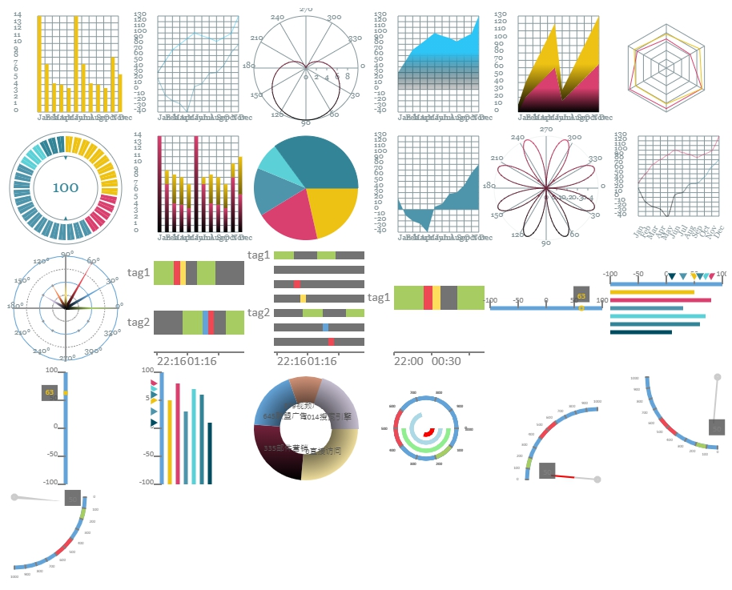
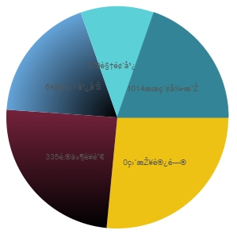
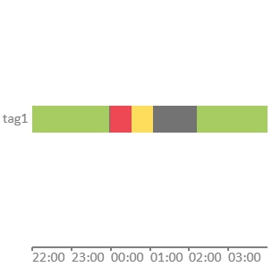
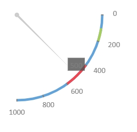

# hichart

    

在使用 html5 `<canvas>` 物件繪圖時，有時會希望將圖表整合進 canvas 畫面中，一般的 chart 套件需要使用獨立的 canvas 畫布通常無法進行整合至同一個 canvas 畫布上。為此需求，開發出 hichart。  

使用範例:  

    var canvas = document.getElementById("canvas");
    var context = canvas.getContext("2d");

    var A = new hichart('Bar',context,{x:0,y:0,width:150,height:150},{
		series:[{
			data:[14, 7, 4.2, 4, 3.5, 14, 7, 4.2, 4, 3.5, 8, 5.5]
		}]
	})

第一個參數 **chartType** 表示 `chartType` 選擇你所要使用的圖表類型。  
第二個參數 **g** 使用相同的 `context` 即可將圖形繪製至同一張 canvas 畫布上。  
第三個參數 **rect** 為繪製區域座標及繪製區域大小。  
第四個參數 **options** 繪圖相關配置。   

- hichart 支援`fabric.js`使用`fabric.util.createClass`創建自己的 class物件。
- hichart 支援 hightopo ht.js中組件開發，並可將組件套用至圖標供 ht編輯器使用。

- hichart support `fabric.js`. you can use `fabric.util.createClass` create hichart class.
- hichart support `ht.js`. you can use hichart in hightopo components then create symbols in ht-editor.

**MIT License**

## Fabric.js 展示  

    

------------

# 範例展示  

## Line  

    

	var B = new hichart('Line',context2,canvas2, {
		sections:12,
		columnSize: 40,
		rowSize: 40,
		Val_max:130,
		Val_min:-40,
		stepSize:10,
		xAxis:{
			label:{
				enableRotate: true,
				rotate: 60,
				textBaseline: 'top',
				textAlign: 'right'
			},
			categories:["Jan", "Feb", "Mar", "Apr", "May", "Jun", "Jul", "Aug", "Sep", "Oct", "Nov", "Dec"]
		},
		series:[
			{
				data:[30, 50, 70, 80, 90, 100, 95, 91, 85, 92, 99, 130],
				color: "#d9406f",
				linearGradient:[{position:0,color:"#000000"},{position:1,color:"#2dc4f6"}]
			},
			{
				data:[20, -10, -20, -25, -40, 5, 10, 28, 30, 43, 65, 80],
				color: "#4e94ab",
				linearGradient:[{position:0,color:"#000000"},{position:1,color:"#4e94ab"}]
			}
		]
	})

## bezier Curve  Line

    

	var B = new hichart('BZLine',context2,canvas2, {
		sections:12,
		columnSize: 40,
		rowSize: 40,
		Val_max:130,
		Val_min:-40,
		stepSize:10,
		xAxis:{
			label:{
				enableRotate: true,
				rotate: 60,
				textBaseline: 'top',
				textAlign: 'right'
			},
			categories:["Jan", "Feb", "Mar", "Apr", "May", "Jun", "Jul", "Aug", "Sep", "Oct", "Nov", "Dec"]
		},
		series:[
			{
				data:[30, 50, 70, 80, 90, 100, 95, 91, 85, 92, 99, 130],
				color: "#d9406f",
				linearGradient:[{position:0,color:"#000000"},{position:1,color:"#2dc4f6"}]
			},
			{
				data:[20, -10, -20, -25, -40, 5, 10, 28, 30, 43, 65, 80],
				color: "#4e94ab",
				linearGradient:[{position:0,color:"#000000"},{position:1,color:"#4e94ab"}]
			}
		]
	})

## Bar  

  

	var A = new hichart('Bar',context1,canvas1,{
		series:[{
			data:[14, 7, 4.2, 4, 3.5, 14, 7, 4.2, 4, 3.5, 8, 5.5],
			color: "#d9406f",
			linearGradient:[{position:0,color:"#000000"},{position:1,color:"#2dc4f6"}]
		},{
			data:[0, 2, 4.2, 4, 3.5, 0, 1, 4.2, 4, 3.5, 2, 5.5],
			color: "#4e94ab",
			linearGradient:[{position:0,color:"#000000"},{position:1,color:"#d9406f"}]
		}]
	})

## Stacked Bar  

  

	var D = new hichart('StackedBar',context5,canvas5,{
		series:[{
			data:[14, 7, 4.2, 4, 3.5, 14, 7, 4.2, 4, 3.5, 8, 5.5],
			color: "#d9406f",
			linearGradient:[{position:0,color:"#000000"},{position:1,color:"#d9406f"}]
		},{
			data:[0, 2, 4.2, 4, 3.5, 0, 1, 4.2, 4, 3.5, 2, 5.5],
			color: "#4e94ab",
			linearGradient:[{position:0,color:"#000000"},{position:1,color:"#edc214"}]
		}]
	})

## Stacked Area  

  

	var B = new hichart('StackedArea',context10,canvas10, {
		sections:12,
		Val_max:130,
		Val_min:0,
		stepSize:10,
		xAxis:{
			categories:["Jan", "Feb", "Mar", "Apr", "May", "Jun", "Jul", "Aug", "Sep", "Oct", "Nov", "Dec"]
		},
		series:[{
			data:[10,20,30,40,50,60,15,25,35,45,55,65],
			color: "#d9406f",
			linearGradient:[{position:0,color:"#000000"},{position:1,color:"#d9406f"}]
		},{
			data:[10,20,30,40,50,60,15,25,35,45,55,65],
			color: "#4e94ab",
			linearGradient:[{position:0,color:"#000000"},{position:1,color:"#edc214"}]
		}]
	})

## Area  

  

	var B = new hichart('Area',context8,canvas8, {
		sections:12,
		Val_max:130,
		Val_min:-40,
		stepSize:10,
		xAxis:{
			categories:["Jan", "Feb", "Mar", "Apr", "May", "Jun", "Jul", "Aug", "Sep", "Oct", "Nov", "Dec"]
		},
		series:[
			{
				data:[30, 50, 70, 80, 90, 100, 95, 91, 85, 92, 99, 130],
				color: "#2dc4f6",
				linearGradient:[{position:0,color:"rgba(0,0,0,0.2)"},{position:1,color:"#2dc4f6"}]
			}
		]
	})

## Area2  

  

	var B = new hichart('Area',context9,canvas9, {
		sections:12,
		Val_max:130,
		Val_min:-40,
		stepSize:10,
		xAxis:{
			categories:["Jan", "Feb", "Mar", "Apr", "May", "Jun", "Jul", "Aug", "Sep", "Oct", "Nov", "Dec"]
		},
		series:[
			{
				data:[20, -10, -20, -25, -40, 5, 10, 28, 30, 43, 65, 80],
				color: "#4e94ab"
			}
		]
	})

## custom Pie  

  

	var A = new hichart('Pie',context3,{x:0,y:0,width:300,height:300},{
		margin:5,
		series:[{
			text:{
				enable:true
			},
			data: [ 
                {value: 14, name: '直接访问'},
                {value: 7, name: '邮件营销', linearGradient:[{position:0,color:"#000000"},{position:1,color:"#d9406f"}]},
                {value: 4.2, name: '联盟广告'},
                {value: 4, name: '视频广告'},
                {value: 3.5, name: '搜索引擎'}
            ],
			color: "#555555",
			linearGradient:[{position:0,color:"#000000"},{position:1,color:"#d9406f"}]
		}]
	})

額外屬性  

	{
        centerFontSize: 20,
        centerFontText: 100,
        borderColor: 2
    }

## Basic Pie  

  

	var A = new hichart('BasicPie',context7,{x:0,y:0,width:300,height:300},{
		margin:5,
		series:[{
			text:{
				enable:true
			},
			data: [
                {value: 335, name: '直接访问'},
                {value: 310, name: '邮件营销', linearGradient:[{position:0,color:"#000000"},{position:1,color:"#d9406f"}]},
                {value: 234, name: '联盟广告', radialGradient:[{position:0,color:"#000000"},{position:1,color:"#64A3D8"}]},
                {value: 135, name: '视频广告'},
                {value: 248, name: '搜索引擎'}
            ],
			color: "#555555",
			linearGradient:[{position:0,color:"#000000"},{position:1,color:"#d9406f"}]
		}]
	})

## Doughnut 

  

	var A = new hichart('DoughnutPie',context7,{x:0,y:0,width:300,height:300},{
		margin:5,
		series:[{
			text:{
				enable:true
			},
			data: [
                {value: 335, name: '直接访问', radialGradient:[{position:0,color:"#000000"},{position:1,color:"#ECDB9B"}]},
                {value: 310, name: '邮件营销', linearGradient:[{position:0,color:"#000000"},{position:1,color:"#d9406f"}]},
                {value: 234, name: '联盟广告', radialGradient:[{position:0,color:"#000000"},{position:1,color:"#64A3D8"}]},
                {value: 135, name: '视频广告', radialGradient:[{position:0,color:"#000000"},{position:1,color:"#D19378"}]},
                {value: 248, name: '搜索引擎', radialGradient:[{position:0,color:"#000000"},{position:1,color:"#C2BBCD"}]}
            ],
			color: "#555555",
			linearGradient:[{position:0,color:"#000000"},{position:1,color:"#d9406f"}]
		}]
	})

## Polar  

  

	var data = [];
	for (var i = 0; i <= 100; i++) {
		var theta = i / 100 * 360;
		var r = 5 * (1 + Math.sin(theta / 180 * Math.PI));
		data.push([r, theta]);
	}
    var A = new hichart('Polar',context6,{x:0,y:0,width:300,height:300},{
		sections:1,
		Val_max: 10,
		Val_min: 0,
		stepSize:2,
		margin:10,
		series:[{
			data: data,
			color: "#d9406f",
			linearGradient:[{position:0,color:"#000000"},{position:1,color:"#d9406f"}]
		}]
	})

## Polar  

  

	var data = [];
	for (var i = 0; i <= 360; i++) {
		var t = i / 180 * Math.PI;
		var r = Math.sin(2 * t) * Math.cos(2 * t);
		data.push([r, i]);
	}

    var A = new hichart('Polar',context11,{x:0,y:0,width:300,height:300},{
		margin:5,
		Val_max: 0.5,
		Val_min: 0,
		stepSize: 0.1,
		series:[{
			data: data,
			color: "#d9406f",
			linearGradient:[{position:0,color:"#000000"},{position:1,color:"#d9406f"}]
		}]
    })

## Radar  

  

	var B = new hichart('Radar',context12,canvas12, {
        radar: {                                // 雷達圖特殊設定  
            // shape: 'circle',
            name: {
                enable: true,                   // 顯示文字  
                textStyle: {                    // 字型相關設定 (未開發)   
                    color: '#fff',
                    backgroundColor: '#999',
                    borderRadius: 3,
                    padding: [3, 5]
                }
            },
            indicator: [                                      // 指標配置
                { name: 'sales', max: 6500},                  // name: 顯示名稱, max: 最大值
                { name: 'Administration', max: 16000},
                { name: 'Information Techology', max: 30000},
                { name: 'Customer Support', max: 38000},
                { name: 'Development', max: 52000},
                { name: 'Marketing', max: 25000}
            ]
        },
		series:[
			{
				data:[4300, 10000, 28000, 35000, 50000, 19000],
				color: "#d9406f"
            },
            {
				data:[5000, 14000, 28000, 31000, 42000, 21000],
				color: "#edc214"
			}
		]
	})

## Phase Sequence 相序圖 (PhaseSequence)

  

    var A = new hichart('PhaseSequence',context14,{x:0,y:0,width:300,height:300},{
		margin:5,
		series:[{
			text:{
				enable:true
			},
			data: [
				{ value: 50, degree: 0, max: 100, min: 0, distance: 1, radialGradient:[{position:0,color:"#000000"},{position:0.5,color:"#A7CC61"}] },
				{ value: 60, degree: 30, max: 100, min: 0, distance: 1, radialGradient:[{position:0,color:"#000000"},{position:0.5,color:"#64A3D8"}] },
				{ value: 70, degree: 60, max: 100, min: 0, distance: 1, radialGradient:[{position:0,color:"#000000"},{position:0.5,color:"#ED4853"}] },
				{ value: 80, degree: 90, max: 100, min: 0,  distance: 0, radialGradient:[{position:0,color:"#000000"},{position:0.5,color:"#FFDD5C"}] },
				{ value: 90, degree: 120, max: 100, min: 0,  distance: 0, radialGradient:[{position:0,color:"#000000"},{position:0.5,color:"#FF834D"}] },
				{ value: 100, degree: 150, max: 100, min: 0,  distance: 0, radialGradient:[{position:0,color:"#000000"},{position:0.5,color:"#C4B7DA"}] }
			],
			color: "#555555",
			linearGradient:[{position:0,color:"#000000"},{position:1,color:"#d9406f"}]
		}],
		colorList: ["#A7CC61", "#64A3D8", "#ED4853", "#FFDD5C", "#FF834D", "#C4B7DA", "#AEC18B", "#7D9DB7", "#B46267", "#ECDB9B", "#D19378", "#C2BBCD"]
	})

額外屬性  

	{
        phaseSequence:{
            degreeStep: 30,
            startAngle: 0,
            endAngle: 360,
            counterclockwise: false,
            type: {
                type: "twoLengthTriangleNeedle", //percentNeedle,twoLengthNeedle,twoLengthTriangleNeedle
                color: "#CCCCCC",
                secondColor: "#FF0000"
            },
            rangeContainer: {
                offset: 0,
                backgroundColor: "#64A3D8"
            },
            label: {
                endable: false,
                type: "textCloud", //marker, textCloud
                font: {
                    color: "#808080",
                    size: 16
                },
                background: "rgba(80,80,80,0.8)",
                customizeText: "function object input value object"
            }
        }
    }

## timeline (TimelineMulti)

測試資料:  

	var testData = [
        {times: [{"starting_time": 1355752800000, "ending_time": 1355759900000}, {"starting_time": 1355767900000, "ending_time": 1355774400000}]},
        {times: []},
        {times: [{"starting_time": 1355759910000, "ending_time": 1355761900000} ]},
        {times: [{"starting_time": 1355761910000, "ending_time": 1355763910000}]}
    ];

    var testData1 = [
        {times: [{"starting_time": 1355762800000, "ending_time": 1355769900000}, {"starting_time": 1355777900000, "ending_time": 1355784400000}]},
        {times: [{"starting_time": 1355769910000, "ending_time": 1355771900000}, ]},
        {times: [{"starting_time": 1355771910000, "ending_time": 1355773910000}]}
	];

  

	var B = new hichart('TimelineMulti',context4,{x:150,y:300,width:150,height:150}, {
		series:[
			{label:"tag1",data:testData},
			{label:"tag2",data:testData1}
		]
	});

  

	var B = new hichart('TimelineMulti',context4,{x:300,y:300,width:150,height:150}, {
		timeline:{
			type:{type:"multiTimeLine"},
			lineWidth:10
		},
		series:[
			{label:"tag1",data:testData},
			{label:"tag2",data:testData1}
		]
	});

  

    var B = new hichart('TimelineMulti',context4,{x:450,y:300,width:150,height:150}, {
		series:[
			{label:"tag1",data:testData}
		]
	});

## Linear Gauge (LinearGauge)

測試資料:   

	var value = [
		{ value: 50 },
		{ value: 80 },
		{ value: 30 },
		{ value: 70 },
		{ value: 60 },
		{ value: 10 }
	];
	  
	var value1 = [
		{ value: 63 }
	];

  

	var canvas18 = document.getElementById("canvas18");
    var context18 = canvas18.getContext("2d");
    var B = new hichart('LinearGauge',context4,{x:600,y:300,width:150,height:150}, {
		Val_max: 100,
		Val_min: -100,
		linearGauge:{
			bar:{
                padding: 5
			},
			lineWidth:5,
			font: {
                size: 10
            },
			type: { type: "circle" }, 
			label: { 
				type: "textCloud",
				font:{
					size: 10,
				},
				padding: 5
			} 
		},
		series:[
			{label:"tag1",data:value1}
		]
	});

  

	var canvas19 = document.getElementById("canvas19");
    var context19 = canvas19.getContext("2d");
    var B = new hichart('LinearGauge',context4,{x:750,y:300,width:150,height:150}, {
		Val_max: 100,
		Val_min: -100,
		linearGauge:{
			bar:{
                padding: 5
			},
			lineWidth:5,
			font: {
                size: 10
            },
			label: { type: "marker"}
		},
		series:[
			{label:"tag1",data:value}
		]
	});

  

	var canvas20 = document.getElementById("canvas20");
    var context20 = canvas20.getContext("2d");
    var B = new hichart('LinearGauge',context4,{x:0,y:450,width:150,height:150}, {
		Val_max: 100,
		Val_min: -100,
		linearGauge:{
			bar:{
                padding: 5
			},
			lineWidth:5,
			font: {
                size: 10
            },
			type: { type: "rectangle" }, 
			label: { 
				type: "textCloud",
				font:{
					size: 10,
				},
				padding: 5
			}, 
			orientation: "vertical"
		},
		series:[
			{label:"tag1",data:value1}
		]
	});

  

	var canvas21 = document.getElementById("canvas21");
    var context21 = canvas21.getContext("2d");
    var B = new hichart('LinearGauge',context4,{x:150,y:450,width:150,height:150}, {
		Val_max: 100,
		Val_min: -100,
		linearGauge:{
			bar:{
                padding: 5
			},
			lineWidth:5,
			font: {
                size: 10
            },
			orientation: "vertical", 
			label: { type: "marker"}
		},
		series:[
			{label:"tag1",data:value}
		]
	});

## Gauge (Gauge)

  

  

  

  

# Options  

共同配置:  

	{
		sections:12,  // x 軸資料點個數 (type number)  
		Val_max:14,   // y 軸最大值  
		Val_min: 0,   // y 軸最小值  
		stepSize:1,   // y 軸間距  
		columnSize:20,// 下方文字間距  
		rowSize:40,   // 左方文字間距  
		margin:10,    // 邊界間距  
		label:{
			fontSize: 10   // x, y 軸 label 文字大小  
		},
		stick:{
			size:3  //  label 標記尺寸  
		},
        xAxis:{                             // x 軸設定  
			label:{                         // label 配置  
				enableRotate: false,        // 啟用 label 文字旋轉 (用於文字太長旋轉避免重疊)  
				rotate: 0,                  // 旋轉角度  
				textBaseline: 'alphabetic', // 文字垂直基準線 baseline  
				textAlign: 'start'          // 文字水平對齊點  
			},
			showGrid: true,                 // 顯示 x 軸垂直線  
			gridLineWidth: 1,               // 格線寬度  
			categories:["Jan", "Feb", "Mar", "Apr", "May", "Jun", "Jul", "Aug", "Sep", "Oct", "Nov", "Dec"]  //  x 顯示文字  
		},
        yAxis:{                             // y 軸設定  
			label:{                         // label 配置  
				enableRotate: false,        // 啟用 label 文字旋轉 (用於文字太長旋轉避免重疊) 
				rotate: 0,                  // 旋轉角度  
				textBaseline: 'alphabetic', // 文字垂直基準線 baseline  
				textAlign: 'start'          // 文字水平對齊點  
			},
			showGrid: true,                 // 顯示 x 軸垂直線  
			gridLineWidth: 1                // 格線寬度  
		},
		series:[  // 資料數組配置  
			{
				data:[30, 50, 70, 80, 90, 100, 95, 91, 85, 92, 99, 130],   // 資料數據 (依圖表有所差異)  
				color: "#d9406f",                                          // 顏色  
				linearGradient:[                                           // 線性漸層色 (優先度高於 color)
					{position:0,color:"#000000"},                          // position: (0 ~ 1)  
					{position:1,color:"#2dc4f6"}
				]
			},
			{
				data:[20, -10, -20, -25, -40, 5, 10, 28, 30, 43, 65, 80],
				color: "#4e94ab"
			}
		],
        colorList:['#edc214', '#d9406f', '#4e94ab', '#5bd1d7','#348498','#004d61','#ff502f']   // 未配置顏色時使用色碼組  
    }

# API  開發說明  

檔案命名原則:  
hichart_**xxxxxx**.js  

xxxxxx可替換為 chart 類型名稱  

prototype命名規則:  
hichart.prototype.plot**Radar**Data  

Radar: 為 `chartType`，main 中會以此呼叫對應的 plot data 函數。  

`hichart_main.js`:  

創建物件  

	function hichart(chartType, g, rect, options)

- 第一個參數 **chartType** 表示 `chartType` 選擇你所要使用的圖表類型。  
- 第二個參數 **g** 使用相同的 `context` 即可將圖形繪製至同一張 canvas 畫布上。  
- 第三個參數 **rect** 為繪製區域座標及繪製區域大小。  
- 第四個參數 **options** 繪圖相關配置。   

深層合併 json 物件使用  

	hichart.prototype.mergeDeep  

數組資料取代合併  

	hichart.prototype.mergeSeriesData

`hichart_axis`:  

繪製軸線格點  

	hichart.prototype.plotAxisData  

`hichart_line.js`:  

	hichart.prototype.defaultLineOptions  // 圖形特殊屬性配置函數名稱
	hichart.prototype.plotLineData        // 圖形繪製函數名稱  