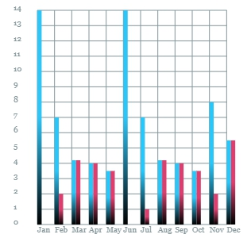

# hichart

    

------------

## Line  

    

## Bar  

  

## Stacked Bar  

  

## Stacked Area  

  

## Area  

  

## Area2  

  

## custom Pie  

  

## Basic Pie  

  

## Polar  

  

## Polar  

  

## Radar  

  